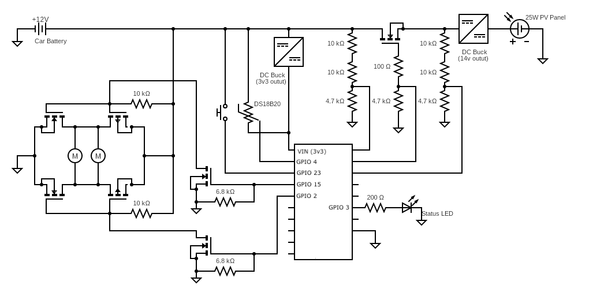

Features:

- Opens and closes the doors of a 8x16 greenhouse when the temperature is outside of a set range.
- Microcontroller is an ESP32 Devkit V1 development board.
- Powered by a 12v car battery, kept charged by a 25W solar panel.
- Electronics are enclosed in waterproof case.
- Doors are opened and closed by linear actuators with 40cm travel.
- Actuators take 30 seconds to fully open or close. In lieu of a PID controller, the following logic is used:
  - If the greenhouse temp is below 80F (or over 90F), close (or open) the doors for 5 seconds
  - Sleep for 3 minutes.
  - It takes 18 minutes to fully open or close the doors.
  - The slow speed of door movement and large acceptable temperature range prevents oscillation.

Schematic:

